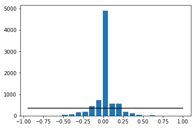
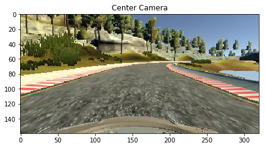
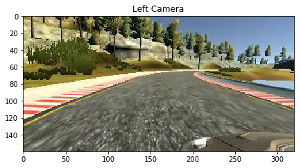
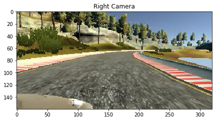
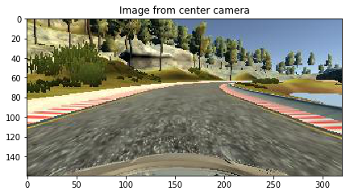
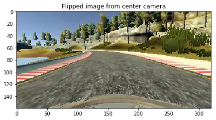
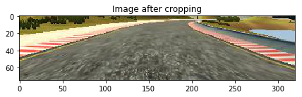
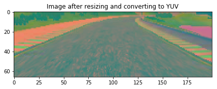

# **Behavioral Cloning** 

---

**Behavioral Cloning Project**

The goals / steps of this project are the following:
* Use the simulator to collect data of good driving behavior
* Build, a convolution neural network in Keras that predicts steering angles from images
* Train and validate the model with a training and validation set
* Test that the model successfully drives around track one without leaving the road
* Summarize the results with a written report

Reading the image path and steering angle from the driving log csv file. I will be using the data provided by Udacity as i was not able to record new data properly in my machine.

Let's see the distribution of data.

Number of images with zero steering angles 4361
Number of images with positive steering angles 1900
Number of images with negative steering angles 1775

I will split the data(i.e paths to images) into training and validation samples(80% training and 20% validation)

Plotting some images

I will flip some of the images in the generator as a augmentation step.Let's look at a vertical flipped image.

For training the model we don't require the upper portion(sky) in the image and the car's hood. So i will crop the image and plot it. I have used this cropping technique as a pre-processing step in the generator where the images are fetched and given to the model.

### Model Architecture and Training Strategy

#### 1. Solution Design Approach

At first i tried the model given in the classroom videos in Behavioral cloning project,video no 10. The architecture was 2 convolution 2d model with depth 6 and kernel size of 5x5 followed by maxpooling, then flattening and finally 3 dense layers with 120,84 and 1 neurons.

I didn't use any kind of augmentation at this point. The model was not giving satisfactory results.

#### 2. Final Model Architecture

After some searching i found that the [NVIDIA network architecture](https://images.nvidia.com/content/tegra/automotive/images/2016/solutions/pdf/end-to-end-dl-using-px.pdf)  is very good for simulating a self driving car. It takes the input image with dimensions 66x200x3(height,width,channels) and takes the images in YUV format. So i resized the image after cropping and converted it into YUV format before feeding into the model.
The image is normalized before passing to the model.

The model summary will be printed in the upcoming block.
A **dropout of 0.5 is added after 5 convolutions to prevent overfitting**.
ELU Activation is used in this model.Because in contrast to ReLUs, ELUs have negative
values which allows them to push mean unit activations closer to zero.[Source](http://image-net.org/challenges/posters/JKU_EN_RGB_Schwarz_poster.pdf)

    Shape of image (66, 200, 3)

#### 3. Creation of the Training Set & Training Process

I am adding all the center camera images in the training set.
From the distribution of the data shown above we can see that most of the time the car drives with 0 steering angle(i.e we can say that there are less turns on the road). So to combat overfitting the straight driving behaviour i will add the images from the left and right cameras by adjusting the steering angle by a factor of +/- 0.2 for left and right camera image respectively.I will also flip the center image vertically,reverse it's steering angle and add it to the dataset. Flipping is done so that if the car is trained on one kind of turn(e.g left turn) it will train on other kind of turn(e.g right turn) too.

By this approach each time when the steering angle is not zero 3 augmented images are added to the dataset.

I have used generator for loading the images and augmenting them in batches.Generator is used so that while training the model, it doesn't run out of memory when there are too many images in the memory.

Generator architecture:
* load sample data(i.e paths to images).
* shuffle once.
* load images into memory with the number of images being loaded equal to batch size(32 in this program).
* augment images by the method written above.
* shuffle and return images.
* repeat last 3 points till all the images are fetched.

The generator output is fed to the model where **"Adam Optimizer" is used so the learning rate was not tuned manually** and "Mean Squared Error" is used as loss function. I have used a *checkpointer to save only the best weights*.

I found from observations that running this model for **10 epochs** gives satisfactory resutls after running the simulator in autonomous mode.

    Using TensorFlow backend.

    ____________________________________________________________________________________________________
    Layer (type)                     Output Shape          Param #     Connected to                     
    ====================================================================================================
    convolution2d_1 (Convolution2D)  (None, 31, 98, 24)    1824        convolution2d_input_1[0][0]      
    ____________________________________________________________________________________________________
    convolution2d_2 (Convolution2D)  (None, 14, 47, 36)    21636       convolution2d_1[0][0]            
    ____________________________________________________________________________________________________
    convolution2d_3 (Convolution2D)  (None, 5, 22, 48)     43248       convolution2d_2[0][0]            
    ____________________________________________________________________________________________________
    convolution2d_4 (Convolution2D)  (None, 3, 20, 64)     27712       convolution2d_3[0][0]            
    ____________________________________________________________________________________________________
    convolution2d_5 (Convolution2D)  (None, 1, 18, 64)     36928       convolution2d_4[0][0]            
    ____________________________________________________________________________________________________
    dropout_1 (Dropout)              (None, 1, 18, 64)     0           convolution2d_5[0][0]            
    ____________________________________________________________________________________________________
    flatten_1 (Flatten)              (None, 1152)          0           dropout_1[0][0]                  
    ____________________________________________________________________________________________________
    dense_1 (Dense)                  (None, 100)           115300      flatten_1[0][0]                  
    ____________________________________________________________________________________________________
    dense_2 (Dense)                  (None, 50)            5050        dense_1[0][0]                    
    ____________________________________________________________________________________________________
    dense_3 (Dense)                  (None, 10)            510         dense_2[0][0]                    
    ____________________________________________________________________________________________________
    dense_4 (Dense)                  (None, 1)             11          dense_3[0][0]                    
    ====================================================================================================
    Total params: 252,219
    Trainable params: 252,219
    Non-trainable params: 0
    ____________________________________________________________________________________________________

